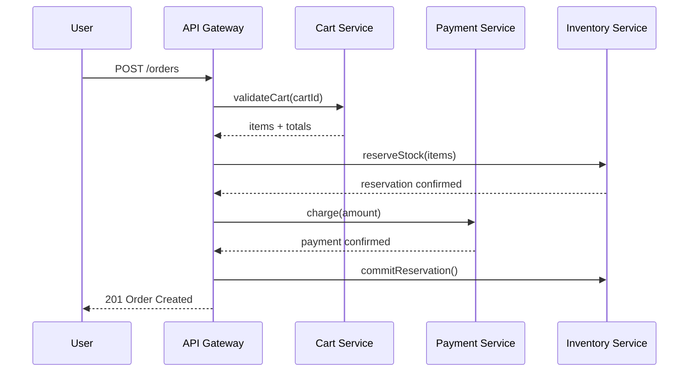

# Diagramming

## Format Selection

Diagrams are for humans, not agents. Pick the lightest format that communicates.

| Scenario | Best format | Why |
|----------|------------|-----|
| Branching logic / decision trees | ASCII tree | Text-native, no rendering needed |
| Simple process flow (<6 steps) | Numbered list or ASCII | Mermaid is ceremony overhead |
| Entity relationships (ERD) | Mermaid | Connections aren't linear — visual layout helps |
| Temporal flows (sequence) | Mermaid | Participant lanes need 2D |
| Architecture overview (C4) | Mermaid | Spatial relationships matter |
| Cloud/infra architecture (AWS, GCP) | Mermaid (architecture-beta) | Built-in icons map to service categories |

**Backtracking:** If you picked Mermaid and the diagram is fighting you (too dense, wrong topology), step back and ask: "Would an ASCII tree or numbered list work here?" Switching format early is cheap; polishing the wrong format is expensive.

For theme presets (documentation, review, presentation), see `resources/mermaid-theme-presets.md`.
For AWS/cloud architecture diagrams with service icons, see `resources/mermaid-aws-architecture.md`.

## Which Mermaid Diagram Type?

| Audience | Recommended Type | Why this pairing |
|----------|------------------|-----------------|
| Developer (self) | Flowchart, Sequence | Low ceremony, evolves with code — won't become stale because author maintains it |
| Team review | Class, ERD | Structural types anchor discussion on "what exists" rather than "what happens" — stable enough for monthly review |
| External stakeholders | C4 Context/Container | Hides implementation detail; named abstraction levels (Context, Container) prevent accidental over-detail |
| Documentation | Sequence, State | Temporal types answer "what happens when..." — the question readers actually have |
| Cloud/infra | Architecture (architecture-beta) | Built-in icons (`cloud`, `database`, `disk`, `internet`, `server`) map to AWS service categories |

**Rule:** Match diagram complexity to how often it will be viewed and updated. Over-detailed diagrams become stale.

## Ambiguous Cases

When the obvious type doesn't work or multiple types seem to apply:

| Scenario | Wrong instinct | Better choice | Why |
|----------|---------------|---------------|-----|
| API with complex auth + data flow | Sequence (everything in one) | C4 Context + Sequence pair | Auth flow and data flow have different audiences; separating keeps each readable |
| Microservice interactions | Flowchart | Sequence with participants | Flowcharts lose the "who sends what to whom" — sequence preserves actor identity |
| State machine with side effects | State diagram alone | State + Sequence pair | State shows valid transitions; sequence shows what happens during each transition |
| DB schema for review | Class diagram | ERD | Class diagrams imply methods/behavior; ERDs focus on relationships and cardinality |
| Build/deploy pipeline | Sequence | Flowchart with subgraphs | Pipelines branch and merge; sequence diagrams are linear and can't show parallelism |
| AWS/cloud topology | C4 Context | Architecture (architecture-beta) | architecture-beta shows infra detail with service icons; C4 is better for abstract system boundaries |

**Default order for new systems**: C4 Context → ERD → Sequence → Class (broad to narrow)

## Splitting and Scoping

### When to Split a Diagram

| Signal | Action |
|--------|--------|
| >15-20 nodes | Split by bounded context or service boundary |
| Multiple audiences | Separate views: one for devs, one for stakeholders |
| Cross-cutting concerns (auth, logging) | Extract to a reference diagram linked from others |
| Related but independent flows | Separate diagrams, not subgraphs |
| Same process, different phases | Subgraphs within one diagram |

### Splitting Strategy

Split along **bounded contexts**, not along technical layers. "Auth flow" and "payment flow" are good splits. "Frontend nodes" and "backend nodes" are bad splits — they fragment a single interaction across diagrams.

### Evolving Requirements

- **Early design**: Keep diagrams informal (flowcharts, hand-drawn style notes)
- **Stabilizing**: Formalize with proper notation; add to version control
- **Production**: Diagrams live next to code they describe (`docs/architecture/` or inline)

### Versioning Strategy

```
docs/diagrams/
├── auth-flow.mmd           # Current version (no suffix)
├── auth-flow-v1.mmd        # Legacy preserved for reference
└── auth-flow-proposed.mmd  # Under review (delete after decision)
```

**Tip**: Include `%% Last updated: YYYY-MM-DD` comment for staleness detection.

## Worked Example: E-Commerce Order System

**Request:** "Diagram the order processing system"

### Step 1: Pick the type

Audience is dev team for a design review → structural types (Class, ERD) or C4.
But "order processing" is temporal ("what happens when...") → Sequence or Flowchart.
Multiple services involved (cart, payment, inventory) → Sequence preserves actor identity.

**Decision:** Sequence diagram, with participants per service.

### Step 2: Scope check

Actors: User, API Gateway, Cart Service, Payment Service, Inventory Service, Notification Service.
That's 6 participants — under the 15-node threshold, single diagram is fine.

But: happy path + failure paths in one diagram → too dense. **Split:** happy path diagram + payment failure diagram.

### Step 3: Output



**Why this worked:** Sequence preserved "who talks to whom." A flowchart would have shown the same steps but lost the service boundaries — critical for a team reviewing ownership.

## Diagrams for Documentation

When diagrams are destined for docs (READMEs, guides), different rules apply:

| Concern | Documentation context | Working session context |
|---------|----------------------|------------------------|
| Self-contained | Must make sense without surrounding conversation | Can assume shared context |
| Complexity | Simpler — readers skim; aim for <10 nodes | Can be denser for design work |
| Alt-text | Add `%% Alt: <description>` for accessibility | Optional |
| Format bias | Prefer ASCII/lists unless spatial layout genuinely helps | Mermaid is fine |

See `/write-documentation` for when and where to insert diagrams during doc writing.

## Anti-Patterns

| Pattern | Problem | Fix |
|---------|---------|-----|
| **The Kitchen Sink** | 50+ nodes — nobody reads it, nobody updates it | Split by bounded context (see Splitting Strategy above) |
| **Wrong Abstraction** | ERD for process flow, flowchart for interactions | Ask "what question does this answer?" — the answer picks the type |
| **Missing Legend** | Custom notation (colors, line styles) unexplained | Add `%% Legend:` comment block at top |
| **Dead Diagram** | Code changed, diagram didn't — now it misleads | Co-locate with code (`docs/` next to `src/`), add `%% Last updated:` for staleness detection |
| **Over-Detailed** | Implementation details in architecture diagram | Match detail to audience: stakeholders get boxes and arrows, devs get methods and types |
| **Layer Split** | Diagram split by tech layer (FE/BE) instead of by flow | Split by bounded context — one interaction shouldn't span two diagrams |
| **Over-Diagramming** | Diagram for a 3-step process that a sentence explains | Ask: "Does this need spatial layout?" If no, use prose, a list, or an ASCII tree |

For rendering fixes and syntax quirks, see `resources/mermaid-rendering-gotchas.md`.

**See also:** `/design-db` (ERDs for schema design, large ERD strategy), `/design-docker` (multi-container architecture diagrams), `/refactor` (visualizing dependency structure), `/write-documentation` (when and where to insert diagrams in documentation)
