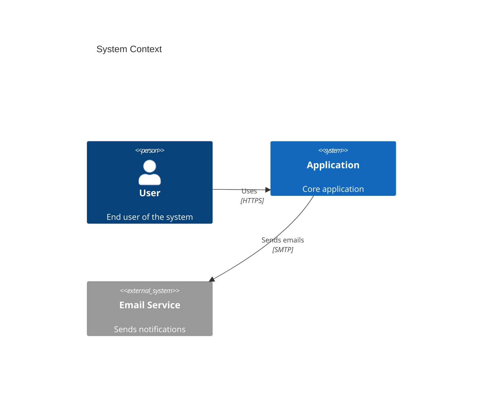
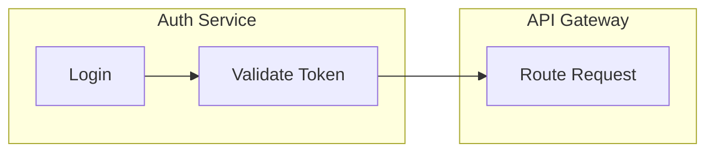

# Mermaid Diagramming

## Which Diagram Type?

| Audience | Time to Create | Maintenance | Recommended Type |
|----------|----------------|-------------|------------------|
| Developer (self) | 5 min | Update with code | Flowchart, Sequence |
| Team review | 15 min | Monthly | Class, ERD |
| External stakeholders | 30 min | Quarterly | C4 Context/Container |
| Documentation | 10 min | With releases | Sequence, State |

**Rule:** Match diagram complexity to how often it will be viewed and updated. Over-detailed diagrams become stale.

## Ambiguous Cases

When the obvious type doesn't work or multiple types seem to apply:

| Scenario | Wrong instinct | Better choice | Why |
|----------|---------------|---------------|-----|
| API with complex auth + data flow | Sequence (everything in one) | C4 Context + Sequence pair | Auth flow and data flow have different audiences; separating keeps each readable |
| Microservice interactions | Flowchart | Sequence with participants | Flowcharts lose the "who sends what to whom" — sequence preserves actor identity |
| State machine with side effects | State diagram alone | State + Sequence pair | State shows valid transitions; sequence shows what happens during each transition |
| DB schema for review | Class diagram | ERD | Class diagrams imply methods/behavior; ERDs focus on relationships and cardinality |
| Build/deploy pipeline | Sequence | Flowchart with subgraphs | Pipelines branch and merge; sequence diagrams are linear and can't show parallelism |

**Default order for new systems**: C4 Context → ERD → Sequence → Class (broad to narrow)

## Splitting and Scoping

### When to Split a Diagram

| Signal | Action |
|--------|--------|
| >15-20 nodes | Split by bounded context or service boundary |
| Multiple audiences | Separate views: one for devs, one for stakeholders |
| Cross-cutting concerns (auth, logging) | Extract to a reference diagram linked from others |
| Related but independent flows | Separate diagrams, not subgraphs |
| Same process, different phases | Subgraphs within one diagram |

### Splitting Strategy

Split along **bounded contexts**, not along technical layers. "Auth flow" and "payment flow" are good splits. "Frontend nodes" and "backend nodes" are bad splits — they fragment a single interaction across diagrams.

### Evolving Requirements

- **Early design**: Keep diagrams informal (flowcharts, hand-drawn style notes)
- **Stabilizing**: Formalize with proper notation; add to version control
- **Production**: Diagrams live next to code they describe (`docs/architecture/` or inline)

### Versioning Strategy

```
docs/diagrams/
├── auth-flow.mmd           # Current version (no suffix)
├── auth-flow-v1.mmd        # Legacy preserved for reference
└── auth-flow-proposed.mmd  # Under review (delete after decision)
```

**Tip**: Include `%% Last updated: YYYY-MM-DD` comment for staleness detection.

## Anti-Patterns

| Pattern | Problem | Fix |
|---------|---------|-----|
| **The Kitchen Sink** | 50+ nodes — nobody reads it, nobody updates it | Split by bounded context (see Splitting Strategy above) |
| **Wrong Abstraction** | ERD for process flow, flowchart for interactions | Ask "what question does this answer?" — the answer picks the type |
| **Missing Legend** | Custom notation (colors, line styles) unexplained | Add `%% Legend:` comment block at top |
| **Dead Diagram** | Code changed, diagram didn't — now it misleads | Co-locate with code (`docs/` next to `src/`), add `%% Last updated:` for staleness detection |
| **Over-Detailed** | Implementation details in architecture diagram | Match detail to audience: stakeholders get boxes and arrows, devs get methods and types |
| **Layer Split** | Diagram split by tech layer (FE/BE) instead of by flow | Split by bounded context — one interaction shouldn't span two diagrams |

## Common Gotchas

| Issue | Fix |
|-------|-----|
| Arrows overlapping in dense diagrams | `%%{init: {'flowchart': {'nodeSpacing': 50}}}%%` |
| GitHub shows raw text instead of diagram | Add blank line before ` ```mermaid ` fence |
| Special chars break rendering | Wrap labels in quotes: `id["My (label)"]` |

## Non-Obvious Syntax Patterns

C4 diagrams use Mermaid's less documented syntax — easy to get wrong:



Subgraph scoping — nodes defined inside a subgraph are scoped; edges must reference the node ID, not the subgraph:



**See also:** `/design-db` (ERDs for schema design), `/refactor` (visualizing dependency structure), `/write-docs` (embedding diagrams in documentation)
