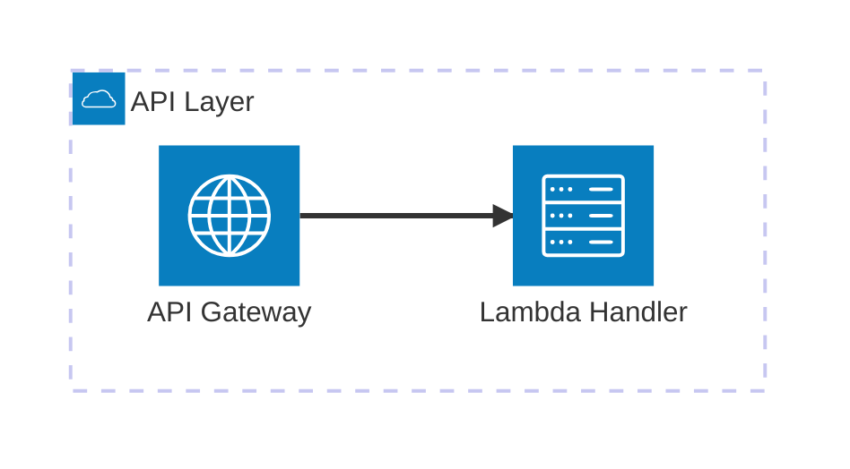
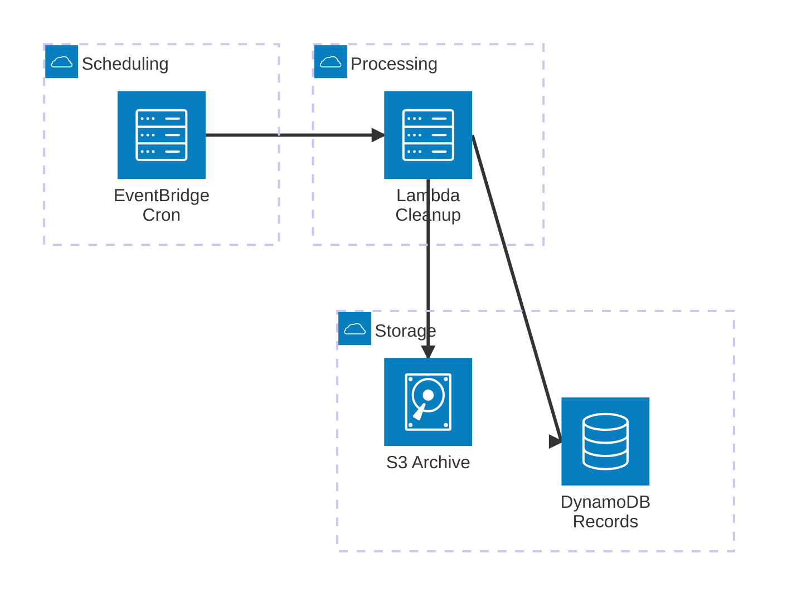
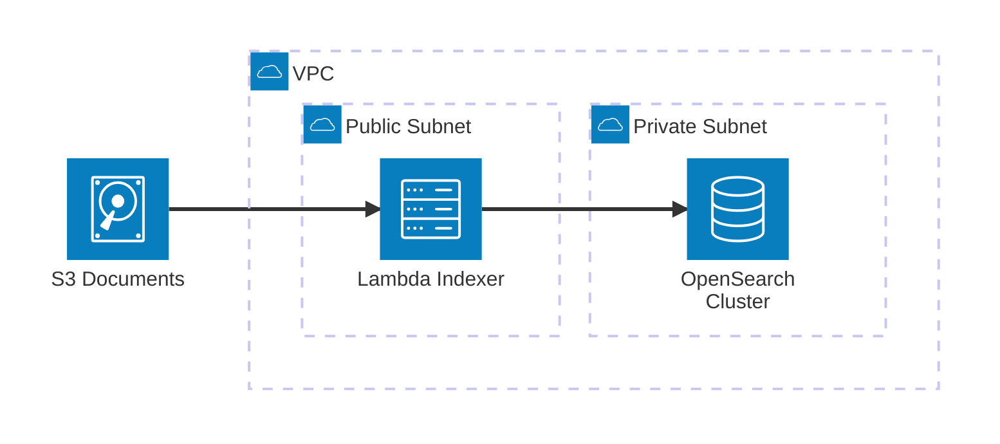

# AWS Architecture Diagrams (Mermaid architecture-beta)

## Syntax Reference

| Element | Syntax | Notes |
|---------|--------|-------|
| Group | `group id(icon)[Label]` | Container for services; can nest via `in parent` |
| Service | `service id(icon)[Label] in group` | `in group` optional for top-level services |
| Edge | `A:R -- L:B` | Positions required: `T`, `B`, `L`, `R` |
| Directional edge | `A:R --> L:B` | Arrow shows data/request direction |
| Reverse edge | `A:R <-- L:B` | Arrow points from B to A |
| Group boundary edge | `svc{group}:R --> L:other` | `{group}` modifier on a service, NOT on group ID |
| Junction | `junction id in group` | 4-way edge splitter, no icon/label |

## Built-in Icons

Only 5 icons render on GitHub. Custom icon packs (Iconify) show blue "?" boxes.

`cloud` · `database` · `disk` · `internet` · `server`

## AWS Service → Icon Mapping

Icon = category, label = specific service.

| Icon | AWS Services |
|------|-------------|
| `server` | Lambda, EC2, ECS/Fargate, SQS, SNS, Step Functions |
| `database` | RDS, DynamoDB, ElastiCache, OpenSearch, Redshift |
| `disk` | S3, EBS, EFS |
| `cloud` | VPC, CloudFront, CloudWatch, IAM, Secrets Manager |
| `internet` | ALB/NLB, API Gateway, Route 53, NAT Gateway |

## Worked Example: API Gateway → Lambda

API Gateway receives requests and invokes Lambda. Simplest multi-resource pattern.

## Worked Example: Scheduled Cleanup Pipeline

EventBridge triggers Lambda on a schedule. Lambda scans DynamoDB for expired items and archives to S3. Shows groups, multiple service types, fan-out edges.

## Worked Example: S3 Ingest to OpenSearch

S3 notification triggers Lambda inside a VPC, which indexes documents in OpenSearch. Shows VPC grouping with nested subnets.

## Rendering Compatibility

| Renderer | Built-in icons | Custom icons (Iconify) |
|----------|---------------|----------------------|
| GitHub | Yes | No — blue "?" boxes |
| Mermaid Live Editor | Yes | Yes |
| mermaid-cli | Yes | Yes |
| VS Code | Depends on extension | Depends on extension |

**Rule:** Always use built-in icons when targeting GitHub or mixed renderers.

## Common Mistakes

| Mistake | Fix |
|---------|-----|
| Edges without positions: `A -- B` | Always specify: `A:R -- L:B` |
| Service declared before its group | Declare `group` first, then `service ... in group` |
| Custom icons for GitHub targets | Use only: `cloud`, `database`, `disk`, `internet`, `server` |
| `{group}` modifier on group ID | Apply `{group}` to a service within the group, not the group itself |
| Colons in labels: `[Lambda: Handler]` | Colons conflict with edge syntax — use `[Lambda Handler]` or `[Lambda - Handler]` |
| Too many services (>12) in one diagram | Split by bounded context — one diagram per subsystem |
