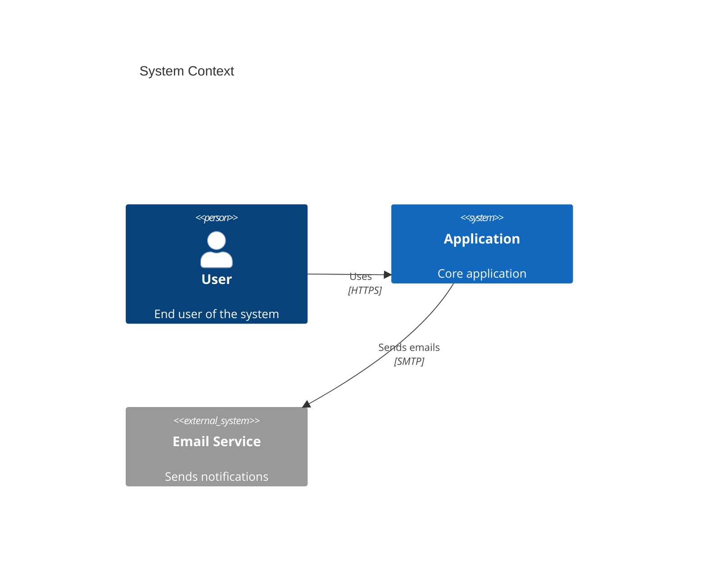
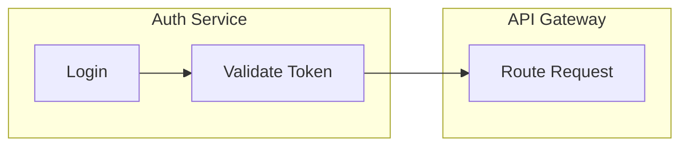

# Mermaid Rendering Gotchas

## Common Issues

| Issue | Fix |
|-------|-----|
| Arrows overlapping in dense diagrams | `%%{init: {'flowchart': {'nodeSpacing': 50}}}%%` |
| GitHub shows raw text instead of diagram | Add blank line before ` ```mermaid ` fence |
| Special chars break rendering | Wrap labels in quotes: `id["My (label)"]` |

## Non-Obvious Syntax Patterns

C4 diagrams use Mermaid's less documented syntax — easy to get wrong:



Subgraph scoping — nodes defined inside a subgraph are scoped; edges must reference the node ID, not the subgraph:



## architecture-beta Gotchas

| Issue | Fix |
|-------|-----|
| Edges render without direction | Always specify positions: `A:R -- L:B`, not `A -- B` |
| Custom icons show as blue "?" on GitHub | Use only built-in: `cloud`, `database`, `disk`, `internet`, `server` |
| Service declared before its group | Declare `group` first, then `service ... in group` |
| Edge from group boundary fails | Use `{group}` modifier on a service: `svc{group}:R --> L:other`, not on group ID |
| Groups can have icons too | `group vpc(cloud)[VPC]` — use to visually distinguish group types |
